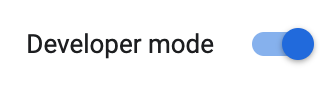
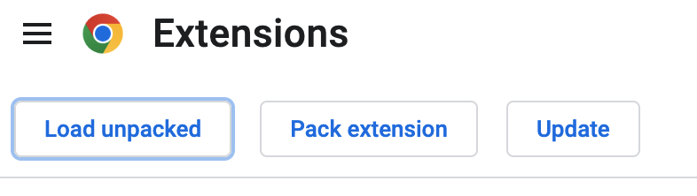

<p align="center">
  
</p>

# Tweetect: Tweet Detection Chrome Extension
[](https://www.gnu.org/licenses/gpl-3.0)

Tweetect is a Chrome extension for Twitter post detection. This software support 2 features:

1. Labelling: Detect 3 types of labels
    - Untrustworthy Post
    - Harmful Post
    - Post with Verifiable Arguments

2. Retweet Preventions
    - Alert pops up when trying to retweet a harmful tweet

# Clone this Repository

In your terminal, run
```
git clone https://github.com/TongyunHuang/Tweet-detection-plugin.git
```


# Run API
You may want to install flask if you havnt done so:
```
pip install Flask
```

First time running the api:
```
cd api
export FLASK_APP=app
export FLASK_ENV=development
flask run
```

If you have already setup environment variables `FLASK_APP` and `FLASK_ENV`, you can just run `flask run` inside the `api` directory

## Resource
[Quickstart - Flask Document](https://flask.palletsprojects.com/en/2.1.x/quickstart/)


# Add Extension to chrome

### 1. Visit: [chrome://extensions/](chrome://extensions/)

### 2. Turn on Developer Mode (top right corner)


### 3. Upload the folder containing `manifest.json` file

(1) Click `Load unpacked` in the top right corner



(2) Choose the 
